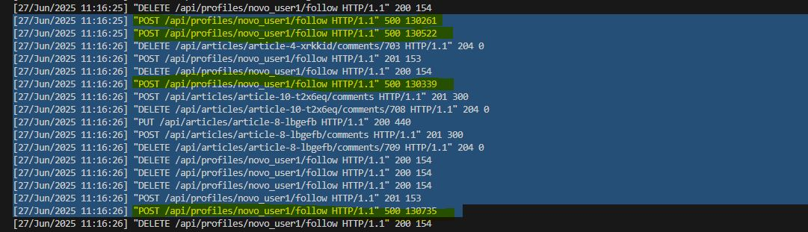
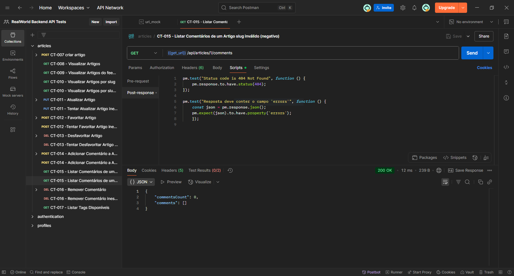
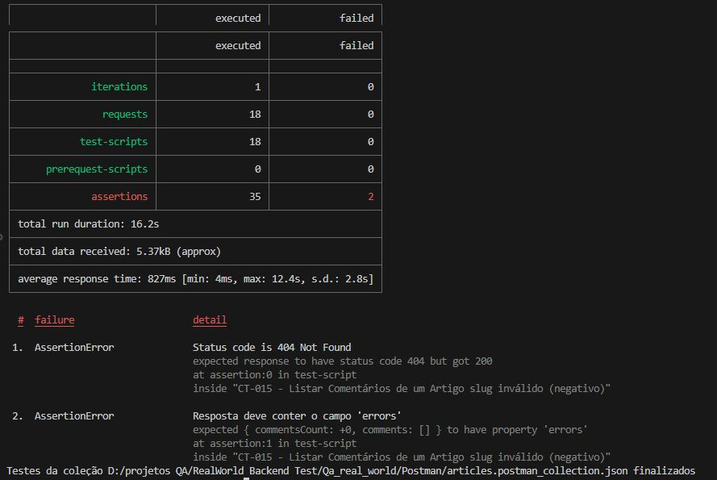
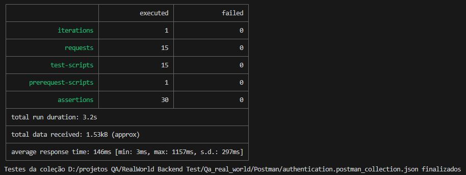
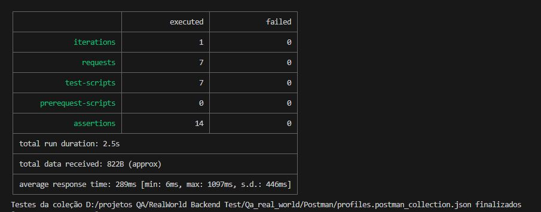
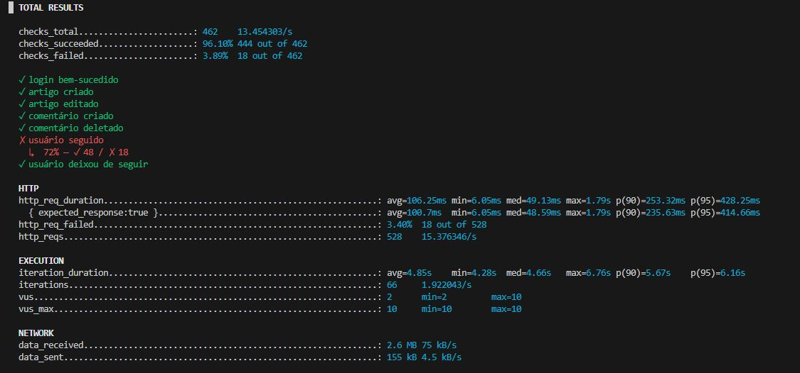

# RealWorld - Testes de API e Performace

A aplicação consiste em um sistema de blog inspirado no [RealWorld](https://github.com/gothinkster/realworld), que permite aos usuários ler, publicar, favoritar e comentar artigos, bem como seguir outros perfis.

**Arquitetura do projeto de testes:**

- `Backend: Django + SQLite`
- `Testes de API com Postman + Newman`
- `Testes de performance com k6`

## Objetivos e Aprendizados

- Validar todas as funcionalidades do backend RealWorld
- Automatizar testes de API e carga
- Praticar o isolamento de testes para não afetar dados reais
- Lidar com erros reais de ambiente
- Documentar bugs e falhas encontradas

---

## ⚙ Tecnologias e Ferramentas

| Camada              | Ferramentas                       |
|---------------------|-----------------------------------|
| Backend             | Django, SQLite                    |
| Testes API          | Postman, Newman                   |
| Testes performance  | k6, k6-html-reporter              |
| CI/CD               | GitHub Actions                    |
| Gerenciamento       | VS Code, Git Bash                 |
| Documentação        | Markdown                          |

---

## Plano de Teste

### 1. Introdução
- **Descrição do sistema**: Aplicação blog para ler, publicar, comentar artigos, seguir perfis e favoritar conteúdos.
- **Objetivo do teste**: Validar funcionalidades e garantir consistência sem erros críticos.

### 2. Escopo
Funcionalidades incluídas:
- Cadastro
- Login
- Configurar perfil (foto, bio, e-mail)
- Visualização de artigos (listagem e filtros)
- Criação e edição de artigos
- Seguir/deixar de seguir perfis
- Comentar/excluir comentários
- Listar comentários por artigo
- Favoritar/desfavoritar artigos

### 3. Metodologia
- **Teste exploratório**  
- **Teste funcional**  
- **Teste de API (status e dados)**  
- **Teste de regressão**  
- **Teste de valor limite**  
- **Teste de autenticação (token)**  
- **Teste de performance (k6)**  

**Critérios de sucesso:**  
- Todos os endpoints retornarem os status HTTP corretos  
- Dados íntegros  
- Performance adequada em carga moderada

**Ambiente de testes**  
- Windows 10 Pro 64 bits  
- Python 3.5.2  
- Django 1.10.5 + SQLite  
- API rodando em 127.0.0.1:8000  
- Ambiente virtual venv  
- Ferramentas: Postman, Newman, K6, Markdown, VS Code, Git Bash

---

## Riscos

- Mudanças frequentes na API podem quebrar casos de teste
  - Mitigação: comunicação contínua + atualização de testes  
- Dependência de token de autenticação
  - Mitigação: automação do login e renovação de token  
- Concorrência de requisições pode causar estado compartilhado
  - Mitigação: isolamento com setup/teardown  
- Falta de cobertura completa de fluxos negativos
  - Mitigação: priorização por impacto de negócio  

---

## Limitações

- Foco nos testes de backend (sem cobertura completa de UI)
- Mensagens de erro em alguns fluxos ainda não padronizadas  
- Dados estáticos (tags/usuários) não são limpos automaticamente  
- Testes negativos parciais: priorizados apenas fluxos críticos  

---

## 🐞 Bugs Encontrados

### Bug 1 — Falha no endpoint follow/unfollow sob carga
- O servidor não suportou 10 usuários simultâneos na ação de seguir usuários.
- **Esperado**: `201 Created`  
- **Ocorreu**: `500 Internal Server Error`  
- **Impacto**: risco de indisponibilidade do recurso de seguir usuários  
- **Recomendação**: revisar controle transacional e testar com banco relacional (PostgreSQL ou MySQL)

**Evidência**  
  

---

### Bug 2 — Código 200 OK em recurso inexistente
- **Cenário**: acessar comentários de um slug inválido  
- **Esperado**: `404 Not Found` ou `400 Bad Request`  
- **Ocorreu**: `200 OK`  
- **Impacto**: mascara erros de recurso inexistente e dificulta depuração

**Evidência**  
  

---

## ✅ Resultados dos Testes

- **Status geral**: sucesso para os fluxos positivos
- **Observação**: falha no cenário alternativo (slug inexistente) como descrito acima
- **Testes de performance**: sistema suportou até 5 usuários concorrentes sem falhas críticas  

---

## 📸 Prints dos Testes

- **Prints Newman**  
    
    
    

- **Prints k6**  
    
    

---

## 🎥 GIFs de Execução

- **Execução Newman**  
    

- **Execução k6 (carga)**  
    

- **Execução fluxo completo**  
    

---

## Como Clonar e Executar

1. Clone o repositório
bash
git clone https://github.com/Meydex/RealWorld-Backend-Qa.git

2. Instale dependências do RealWorld
pip install -r requirements.txt

3. Instale dependências do projeto de testes
cd Qa_real_world
npm install

**Execução Manual**

1. Entrar na pasta do ambiente:
`cd productionready-django-api`

2. Entrar no ambiente:
`.\env\Scripts\Activate.ps1 > entrar no ambiente`

3. Rodar servidor local:
`python manage.py runserver`

4. Rodar o teste postman via newman:
`npx node run-tests.js`

5. Rodar k6(seguir ordem abaixo):
- Entra na pasta de teste k6:
    `cd Qa_real_world\k6\script`
- Roda teste de fluxo:
    `k6 run teste_de_fluxo.js`
- Gerar users para usar no teste de carga:
    `node gera_user.js`
- Roda teste de carga:
    `k6 run teste_de_carga.js`

1. roda k6 com reporter json:
`k6 run --out json=resultado_fluxo.json teste_de_fluxo.js k6 run --out json=resultado_carga.json teste_de_carga.js`

2. converter teste para html;
`npx k6-html-reporter resultado_fluxo.json npx k6-html-reporter resultado_carga.json`

6. Limpar usuarios,artigos e autenticações de teste do db com python:
`python clean_test_users.py`
